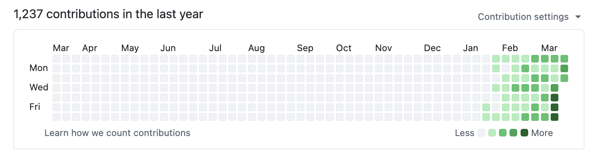
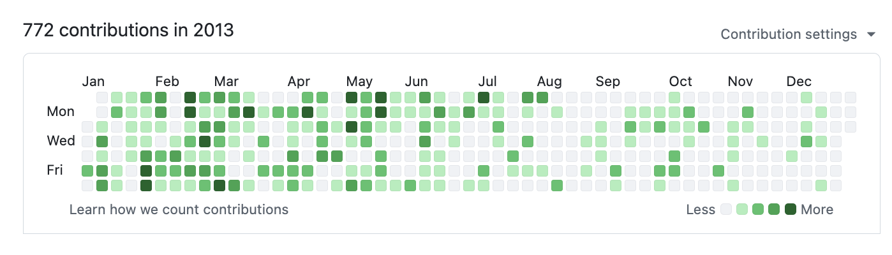

[](LICENSE)


# gstack-ko (한국어 버전)

> **이 저장소는 [garrytan/gstack](https://github.com/garrytan/gstack)의 한국어 번역본입니다.**
> 원본 저장소: https://github.com/garrytan/gstack | 원작자: [Garry Tan](https://x.com/garrytan) (Y Combinator 대표 겸 CEO)

---

**gstack은 Claude Code를 하나의 범용 어시스턴트에서 필요할 때 즉시 소환할 수 있는 전문가 팀으로 바꿔줍니다.**

CEO가 제품을 재사고하고, 엔지니어링 매니저가 아키텍처를 확정하고, 디자이너가 AI 슬롭을 잡아내고, 리뷰어가 프로덕션 버그를 찾고, QA 리드가 실제 브라우저를 열고, 보안 책임자가 OWASP + STRIDE 감사를 실행하고, 릴리스 엔지니어가 PR을 배포합니다. 20명의 전문가와 8개의 파워 툴, 모두 슬래시 커맨드, 모두 마크다운, 모두 무료, MIT 라이선스.





## 빠른 시작

1. gstack 설치 (30초 — 아래 참고)
2. `/office-hours` 실행 — 만들고 있는 것을 설명
3. `/plan-ceo-review` 실행 — 아이디어를 압박 테스트
4. `/review` 실행 — 변경사항이 있는 브랜치에서
5. `/qa` 실행 — 스테이징 URL에서
6. 여기서 멈추세요. 이게 맞는지 알게 됩니다.

## 이 저장소에 대해

**gstack-ko**는 gstack의 스킬 파일과 문서를 한국어로 제공합니다.

| | 이 저장소 (gstack-ko) | 원본 저장소 (gstack) |
|---|---|---|
| 스킬 문서 (SKILL.md) | ✅ 27개 스킬 | ✅ 27개 스킬 |
| 플래닝 스킬 | ✅ | ✅ |
| 리뷰/배포 스킬 | ✅ | ✅ |
| QA/디자인 스킬 | ✅ | ✅ |
| 보안/유틸리티 스킬 | ✅ | ✅ |
| 브라우저 바이너리 (Playwright) | ❌ | ✅ |
| 빌드 스크립트/테스트 | ❌ | ✅ |

`/browse`, `/qa`, `/setup-browser-cookies`는 Playwright 바이너리가 필요합니다. 이 스킬들을 사용하려면 [원본 저장소](https://github.com/garrytan/gstack)를 참고하세요.

## 설치

**요구사항:** [Claude Code](https://docs.anthropic.com/en/docs/claude-code), [Git](https://git-scm.com/)

Claude Code를 열고 다음을 붙여넣으세요. Claude가 나머지를 처리합니다.

> gstack-ko를 설치해줘: `git clone https://github.com/lucas-flatwhite/gstack-ko.git ~/.claude/skills/gstack` 를 실행하고, `~/.claude/skills/` 에 각 스킬의 심볼릭 링크를 생성해줘. 그리고 CLAUDE.md에 "gstack" 섹션을 추가해서 사용 가능한 스킬을 나열해줘: /office-hours, /plan-ceo-review, /plan-eng-review, /plan-design-review, /design-consultation, /review, /ship, /land-and-deploy, /canary, /benchmark, /browse, /qa, /qa-only, /design-review, /setup-browser-cookies, /setup-deploy, /retro, /investigate, /document-release, /codex, /cso, /autoplan, /careful, /freeze, /guard, /unfreeze, /gstack-upgrade.

### 설치되는 것

- 스킬 파일 (마크다운 프롬프트)이 `~/.claude/skills/gstack/`에
- `~/.claude/skills/plan-ceo-review`, `~/.claude/skills/review` 등의 심볼릭 링크
- `/retro`는 추세 추적을 위해 프로젝트의 `.context/retros/`에 JSON 스냅샷을 저장

모든 것이 `.claude/` 안에 있습니다. PATH나 백그라운드 프로세스에 아무것도 건드리지 않습니다.

## 스프린트

gstack은 도구 모음이 아니라 프로세스입니다. 스킬은 스프린트 순서대로 실행됩니다:

**생각 → 계획 → 구현 → 리뷰 → 테스트 → 배포 → 회고**

각 스킬이 다음 스킬에 이어집니다. `/office-hours`가 디자인 문서를 작성하면 `/plan-ceo-review`가 읽습니다. `/plan-eng-review`가 테스트 계획을 작성하면 `/qa`가 실행합니다. `/review`가 버그를 잡으면 `/ship`이 수정을 검증합니다.

### 워크플로우 스킬

| 스킬 | 전문가 | 하는 일 |
|------|--------|---------|
| `/office-hours` | YC 오피스 아워 | 여기서 시작. 코드를 작성하기 전에 제품을 재구성하는 6가지 질문. 전제를 도전하고, 구현 대안을 생성합니다. |
| `/plan-ceo-review` | 창업자 / CEO | 문제를 재사고합니다. 요청 안에 숨어있는 10점짜리 제품을 찾습니다. |
| `/plan-eng-review` | 엔지니어링 매니저 | 아키텍처, 데이터 흐름, 다이어그램, 엣지 케이스, 테스트를 확정합니다. |
| `/plan-design-review` | 시니어 디자이너 | 각 디자인 차원을 0-10으로 평가하고, 10점 기준을 설명한 뒤 계획을 개선합니다. AI 슬롭 감지. |
| `/design-consultation` | 디자인 파트너 | 완전한 디자인 시스템을 처음부터 구축합니다. 경쟁사 조사, 창의적 리스크 제안, 현실적 목업 생성. |
| `/review` | 집착형 스태프 엔지니어 | CI를 통과하지만 프로덕션에서 터지는 버그를 찾습니다. 명백한 것은 자동 수정. |
| `/investigate` | 디버거 | 체계적인 근본 원인 분석. 철칙: 조사 없이 수정 없음. 3번 실패하면 멈춤. |
| `/design-review` | 코딩하는 디자이너 | 시각 감사 후 발견한 이슈를 코드로 직접 수정. 원자적 커밋, 전후 스크린샷. |
| `/qa` | QA 리드 | 앱을 테스트하고, 버그를 찾고, 원자적 커밋으로 수정하고, 재검증. 모든 수정에 회귀 테스트 자동 생성. |
| `/qa-only` | QA 리포터 | `/qa`와 같은 방법론이지만 리포트만. 코드 수정 없이 순수 버그 리포트. |
| `/cso` | 보안 책임자 (CSO) | OWASP Top 10 + STRIDE 위협 모델. 제로 노이즈: 17개 오탐 제외, 8/10+ 신뢰도 게이트. |
| `/ship` | 릴리스 엔지니어 | main 동기화, 테스트 실행, 커버리지 감사, 푸시, PR 생성. |
| `/land-and-deploy` | 릴리스 엔지니어 | PR 머지, CI와 배포 대기, 프로덕션 상태 검증. "승인됨"에서 "프로덕션 검증"까지 한 커맨드. |
| `/canary` | SRE | 배포 후 모니터링 루프. 콘솔 에러, 성능 회귀, 페이지 장애 감시. |
| `/benchmark` | 성능 엔지니어 | 페이지 로드 시간, Core Web Vitals, 리소스 크기 기준선 측정. PR마다 전후 비교. |
| `/document-release` | 테크니컬 라이터 | 배포 후 모든 프로젝트 문서를 실제 변경사항과 매칭하여 업데이트. |
| `/retro` | 엔지니어링 매니저 | 팀 인식형 주간 회고. 개인별 분석, 배포 연속 기록, 테스트 건강 추세. `/retro global`로 전체 프로젝트 + AI 도구 통합 회고. |
| `/browse` | QA 엔지니어 | 실제 Chromium 브라우저, 실제 클릭, 실제 스크린샷. 커맨드당 ~100ms. |
| `/setup-browser-cookies` | 세션 매니저 | 실제 브라우저(Chrome, Arc, Brave, Edge)의 쿠키를 헤드리스 세션으로 가져옵니다. |
| `/autoplan` | 리뷰 파이프라인 | 한 커맨드로 완전히 검토된 계획. CEO → 디자인 → 엔지니어링 리뷰를 자동 실행. 취향 결정만 사용자에게. |

### 파워 툴

| 스킬 | 하는 일 |
|------|---------|
| `/codex` | **세컨드 오피니언** — OpenAI Codex CLI의 독립 코드 리뷰. 리뷰, 적대적 도전, 오픈 상담 세 가지 모드. |
| `/careful` | **안전 가드레일** — 파괴적 커맨드(rm -rf, DROP TABLE, force-push) 전에 경고. "조심해"로 활성화. |
| `/freeze` | **편집 잠금** — 한 디렉토리로 파일 편집 제한. 디버깅 중 범위 밖 변경 방지. |
| `/guard` | **풀 세이프티** — `/careful` + `/freeze` 한 번에. 프로덕션 작업에 최대 안전. |
| `/unfreeze` | **잠금 해제** — `/freeze` 경계 제거. |
| `/setup-deploy` | **배포 설정** — `/land-and-deploy`를 위한 일회성 설정. 플랫폼, 프로덕션 URL, 배포 커맨드 자동 감지. |
| `/gstack-upgrade` | **셀프 업데이터** — gstack을 최신으로 업그레이드. 글로벌 vs vendored 설치 감지, 양쪽 동기화. |

## 데모: 하나의 기능, 처음부터 끝까지

```
나:     캘린더 일일 브리핑 앱을 만들고 싶어.
나:     /office-hours
Claude: [고통에 대해 묻습니다 — 가상이 아닌 구체적 사례]

나:     여러 Google 캘린더, 오래된 정보의 일정, 잘못된 위치...
Claude: 프레이밍에 이의를 제기합니다. "일일 브리핑 앱"이라고 하셨지만
        실제로 설명한 것은 개인 비서장 AI입니다.
        [인식하지 못한 5가지 기능 추출]
        [4가지 전제 도전 — 동의, 반대, 조정]
        [3가지 구현 접근법 + 노력 추정]

나:     /plan-ceo-review
Claude: [디자인 문서 읽고, 범위 도전, 10개 섹션 리뷰]

나:     /plan-eng-review
Claude: [데이터 흐름 ASCII 다이어그램, 상태 기계, 에러 경로]

나:     계획 승인. 계획 모드 종료.
        [11개 파일에 2,400줄 작성. ~8분.]

나:     /review
Claude: [자동 수정] 이슈 2개. [질문] 경쟁 조건 → 수정 승인.

나:     /qa https://staging.myapp.com
Claude: [실제 브라우저 열고, 흐름 클릭, 버그 발견 및 수정]

나:     /ship
        테스트: 42 → 51 (+9 신규). PR: github.com/you/app/pull/42
```

## 병렬 스프린트

gstack은 하나의 스프린트로도 강력합니다. 10개를 동시에 실행하면 판도가 바뀝니다.

[Conductor](https://conductor.build)는 여러 Claude Code 세션을 병렬로 실행합니다 — 각각 자체 격리된 작업공간에서. 한 세션은 `/office-hours`, 다른 세션은 `/review`, 세 번째는 기능 구현, 네 번째는 `/qa`. 동시에. 스프린트 구조가 있기에 병렬 처리가 가능합니다 — 프로세스 없이 10개의 에이전트는 10개의 혼돈일 뿐입니다.

## 문서

| 문서 | 내용 |
|------|------|
| [Builder Ethos](ETHOS.md) | 빌더 철학: Boil the Lake, Search Before Building, 3단계 지식 |
| [Architecture](ARCHITECTURE.md) | 설계 결정과 시스템 내부 |
| [Browser Reference](BROWSER.md) | `/browse` 전체 커맨드 레퍼런스 |
| [Contributing](CONTRIBUTING.md) | 개발 설정, 테스트, 기여자 모드 |
| [Changelog](CHANGELOG.md) | 버전별 변경 이력 |

## 문제 해결

**스킬이 Claude Code에서 나타나지 않을 때?**
Claude Code에 다음을 붙여넣으세요:
> `~/.claude/skills/` 에 gstack-ko 심볼릭 링크를 다시 생성해줘.

**`/browse`, `/qa`, `/setup-browser-cookies`를 사용하고 싶을 때?**
브라우저 바이너리가 필요합니다. [garrytan/gstack](https://github.com/garrytan/gstack) 원본 저장소를 참고하세요.

**Claude가 스킬을 못 찾는다면?** 프로젝트 `CLAUDE.md`에 gstack 섹션이 있는지 확인하세요:

```
## gstack
사용 가능한 스킬: /office-hours, /plan-ceo-review, /plan-eng-review,
/plan-design-review, /design-consultation, /review, /ship, /land-and-deploy,
/canary, /benchmark, /browse, /qa, /qa-only, /design-review,
/setup-browser-cookies, /setup-deploy, /retro, /investigate,
/document-release, /codex, /cso, /autoplan, /careful, /freeze, /guard,
/unfreeze, /gstack-upgrade.
```

## 업그레이드

Claude Code에 다음을 붙여넣으세요:

> gstack-ko를 업데이트해줘: `cd ~/.claude/skills/gstack && git fetch origin && git reset --hard origin/main` 를 실행해줘.

## 제거

Claude Code에 다음을 붙여넣으세요:

> gstack-ko를 제거해줘: `rm -rf ~/.claude/skills/gstack` 을 실행하고, `~/.claude/skills/`에서 gstack 관련 심볼릭 링크를 모두 제거하고, CLAUDE.md에서 gstack 섹션을 제거해줘.

## 라이선스

MIT
